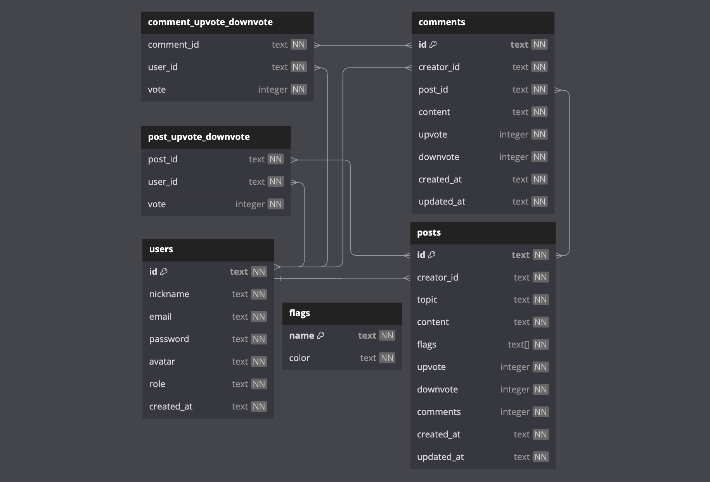

  

<h3 align="center">FULLSTACK PROJECT</h3>
 

## 📝 Description

GeekHub is a full stack project for a forum about technologies in the world of web development. There, users can create posts and interact through comments and votes. Users can also change nickname, password and avatar image, as well as delete their own posts and comments. Furthermore, one of the forum's features is to filter posts by selected topics.

To this end, an API was developed for managing users, posts and interactions made on the GeekHub forum. It is an Express server back-end application with SQLite3 database, where there is data protection and code organization based on layered architecture concepts.

## ☁️ Deploy

Frontend: [geekhub-laisrmacedo.vercel.app/](https://geekhub-laisrmacedo.vercel.app/)

Backend: [geekhub-gxst.onrender.com](https://geekhub-gxst.onrender.com)

## 🗂️ Database Tables

[dbdiagram.io/d/geekhub_project-64038a44296d97641d856e92](https://dbdiagram.io/d/geekhub_project-64038a44296d97641d856e92)

## 📜 Documentation

To view the documentation, go to:  
https://documenter.getpostman.com/view/24460805/2s9YJdUMCJ

## 🛠 Technologies

#### FRONTEND

- React; 
- Styled-Components; 
- Data streams;
- Conditional rendering;
- LocalStorage;
- React Router Dom;
- React Modal;
- React Autosuggest
- Axios;
- API integration;
- Frontend deploying on Surge.sh;
- Backend deploying on Render.com.

#### BACKEND

- NodeJS;
- Typescript;
- Express;
- SQLite3;
- Knex;
- POO;
- Layered Architecture;
- UUID;
- Hashing Passwords;
- Tokens JWT;
- Authentication and Authorization;
- Routing;
- Postman;
- Deploying on Render.com.

## 👩‍💻 Author

Laís Rodrigues Macedo  
laisrodriguesmacedo@gmail.com  
WhatsApp: (+49) 174 7781517

