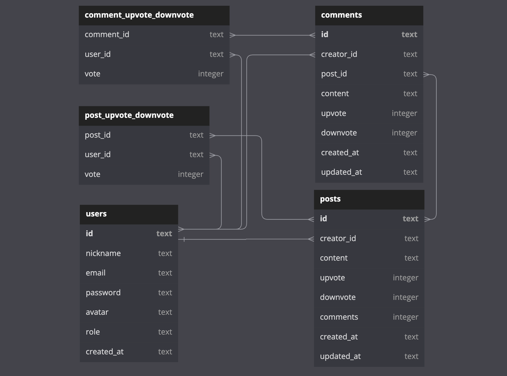

  

<h3 align="center">BACKEND PROJECT</h3>
 

## 📝 Description

User management API, posts and interactions made on the social network LabEddit. It is an express server back-end application with SQLite3 database, where there is data protection and code organization based on layered architecture concepts. It aims to promote interaction between people through posts, votes and comments.

### DATABASE

https://dbdiagram.io/d/64038a44296d97641d856e92

## 📜 Documentation

To view the documentation, go to:  
https://documenter.getpostman.com/view/24460805/2s93Xu3RTW

## ☁️ Deploy

Frontend: [labeddit-laisrmacedo.surge.sh/users/login](https://labeddit-laisrmacedo.surge.sh/users/login)

Backend: [labeddit-backend-deploy.onrender.com/](https://labeddit-backend-deploy.onrender.com/)

## 🧩 Frontend Repository

GitHub: [laisrmacedo/labeddit-frontend](https://github.com/laisrmacedo/labeddit-frontend)

## 🕹 Endpoints

USERS

- POST Login;
- POST Signup;
- GET Users;
- GET User By Id;
- PUT Edit User;
- DEL Delete User;

POSTS

- GET Posts;
- GET Post By Id;
- POST Create Post;
- PUT UpvoteOrDownvote;
- DEL Delete Post;

COMMENTS

- GET Comments;
- POST Create Comment;
- PUT UpvoteOrDownvote;
- DEL Delete Comment;

## 🛠 Technologies

- NodeJS;
- Typescript;
- Express;
- SQLite3;
- Knex;
- POO;
- Layered Architecture;
- UUID;
- Hashing Passwords;
- Tokens JWT;
- Authentication and Authorization;
- Routing;
- Postman;
- Deploying on Render.com.

## 👩‍💻 Author
Laís Rodrigues Macedo  
laisrodriguesmacedo@gmail.com  
WhatsApp: (+49) 174 7781517
